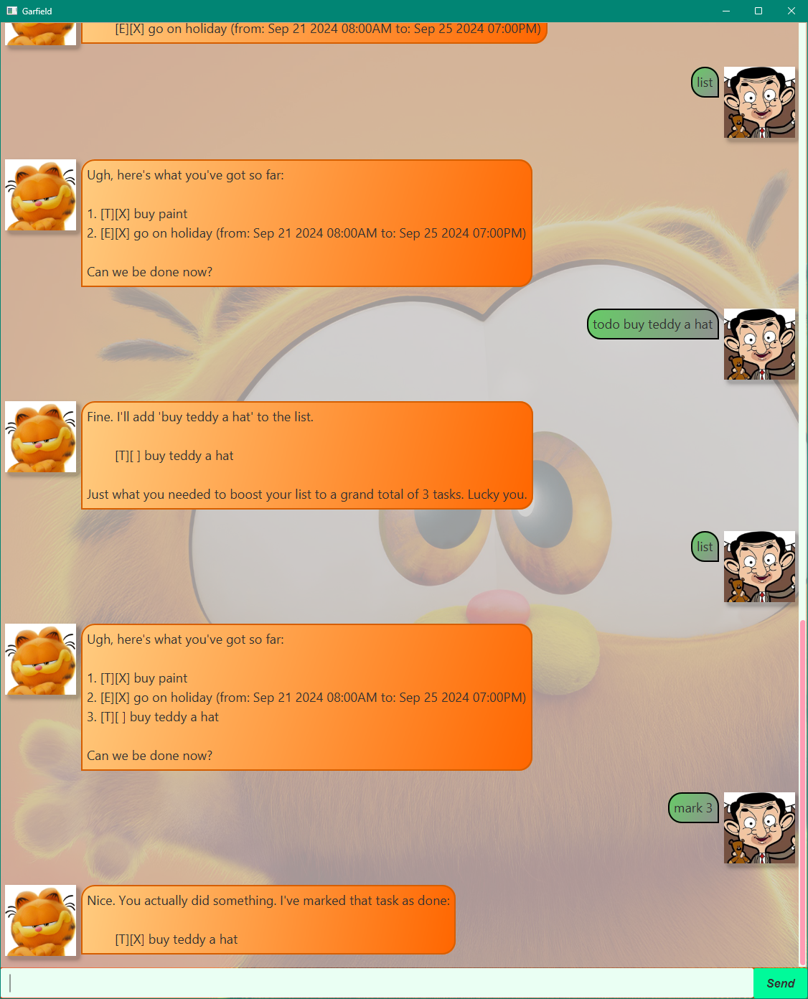

# Garfield User Guide

## Introducing **Garfield Chatbot** 
An easy to use desktop app that allows you to **manage your tasks** through an
intuitive chatbot Graphical User Interface (GUI). Unlike other chatbots, Garfield is unique because of it's
personality, it embodies the classic Garfield attitude, giving you responses that are sarcastic and humourous!

- [Quick start]()
- [Features](#features)
  - [Adding tasks](#adding-tasks)
    - [Adding simple todo tasks: `todo`](#adding-simple-todo-tasks-todo)
    - [Adding tasks with deadlines: `deadline`](#adding-tasks-with-deadlines-deadline)
    - [Adding events with start and end times: `event`](#adding-events-with-start-and-end-times-event)
  - [List all tasks: `list`](#list-all-tasks-list)
  - [Find all tasks containing a keyword: `find`](#find-all-tasks-containing-a-keyword-find)
  - [Delete tasks: `delete`](#delete-tasks-delete)
  - [Marking tasks as complete or incomplete: `mark`, `unmark`](#marking-tasks-as-complete-or-incomplete-mark-unmark)
    - [Mark a task as complete: `mark`](#mark-a-task-as-complete-mark)
    - [Unmark a completed task to make it incomplete: `unmark`](#unmark-a-completed-task-to-make-it-incomplete-unmark)
  - [End the conversation: `bye`](#end-the-conversation-bye)
___

## Quick start

1. Ensure you have Java 17 or above installed in your Computer.

2. Download the latest .jar file from here.

3. Copy the file to the folder you want to use as the home folder for Garfield.

4. Open a command terminal, cd into the folder you put the jar file in, and use the 
`java -jar garfield.jar` command to run the application.

___

## Features

### Adding Tasks

You can add 3 different kinds of tasks with Garfield.

 

#### Adding simple todo tasks: `todo`

Add a new to-do task with a description.

**Usage**: `todo <task description>`

**Example**: `todo Buy groceries`

You should observe a message from Garfield to signal that a new Todo task has
been created successfully.

 

#### Adding tasks with deadlines: `deadline`

Adds a new deadline task with a description and a due date.

**Usage**: `deadline <task description> /by <yyyy-MM-dd HH:mm>`

**Example**: `deadline Submit report /by 2024-10-01 12:00`

You should observe a message from Garfield to signal that a new Deadline task has
been created successfully.

 

#### Adding events with start and end times: `event`

Adds a new event task with a description, start time, and end time.

**Usage**: `event <task description> /from <yyyy-MM-dd HH:mm> /to <yyyy-MM-dd HH:mm>`

**Example**: `event Team meeting /from 2024-09-20 10:00 /to 2024-09-20 12:00`

You should observe a message from Garfield to signal that a new Event task has
been created successfully.

 

### List all tasks: `list`

Description: Lists all the tasks currently stored.

**Usage**: `list`

You should observe a message from Garfield with a list of all tasks.

 

### Find all tasks containing a keyword: `find`

Finds tasks containing a specific keyword.

**Usage**: `find <keyword>`

**Example**: `find project`

You should observe a message from Garfield with a list of all tasks
with that keyword.

 

### Delete tasks: `delete`

Description: Deletes a task / multiple tasks from the list by task ID.

**Usage**: `delete <task id> (Optional additional: <taskid(s)>)`

**Example 1**: `delete 2`

**Example 2**: `delete 1 2 3`

You should observe a message from Garfield to signal that the tasks have
been deleted successfully.

 

### Marking tasks as complete or incomplete: `mark`, `unmark`

You can mark tasks as either complete, or unmark them to become incomplete.

 

#### Mark a task as complete: `mark`

Marks a task as done by task ID.

**Usage**: `mark <task id>`

**Example**: `mark 3`

You should observe a message from Garfield to signal that the task has
been marked as completed successfully.

 

#### Unmark a completed task to make it incomplete: `unmark`
   
Unmarks a task as not done by task ID.

**Usage**: `unmark <task id>`

**Example**: `unmark 3`

You should observe a message from Garfield to signal that the task has
been unmarked to become incomplete successfully.

 

### End the conversation: `bye`

Ends the conversation with Garfield and elicits a snarking closing remark.
Note that this doesn't actually close the Java desktop application.

**Usage**: `bye`
